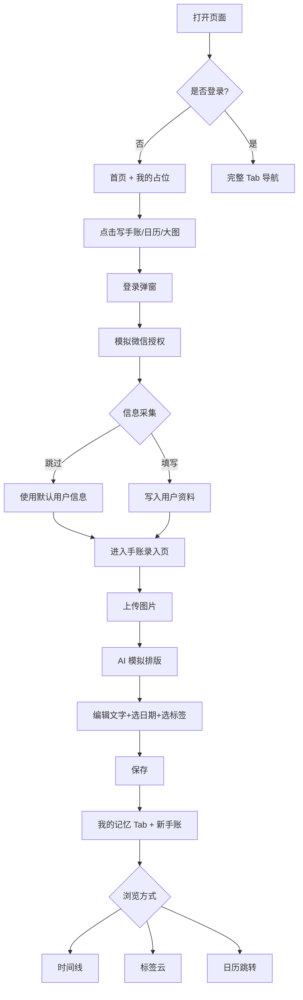

# 懒人手账 - 产品需求文档（PRD）

## 1. 产品概述

懒人手账是一款生活娱乐类微信小程序原型演示（HTML 静态原型），定位于"让 AI 替你记录生活"。用户每日上传照片或视频，AI 模拟识别人物、场景、表情等信息，自动生成简洁日记风的手账文案，结合缩略图形成可编辑的电子手账；同时支持按时间+人物打标签，提供标签云与时间线浏览。
- 目标用户：宝妈、上班族、热爱记录生活的人、手账爱好者
- 演示形态：单文件 HTML，390px iPhone 视口，电脑浏览器可缩放查看
- 核心价值：把零碎生活素材一键沉淀为有温度、有标签的电子手账

## 2. 核心功能

### 2.1 用户角色

| 角色 | 入口 | 核心权限 |
|------|------|----------|
| 游客 | 直接打开 | 仅浏览首页/我的占位页，所有写手账入口触发登录弹窗 |
| 登录用户 | 微信授权模拟 | 完整使用四大 Tab、新增/编辑/删除手账、切换主题 |

### 2.2 功能模块

1. **首页（Tab1）**：搜索栏、每日大图（公历/农历/天气/节假日）、左右双入口卡片、悬浮表情
2. **我的记忆（Tab2）**：时间线卡片 + 置顶手账、标签云筛选、手账详情查看、底部中央+号
3. **手账日历（Tab3）**：月视图日历、当日手账摘要+表情、点击日期跳转我的记忆、底部中央+号
4. **我的（Tab4）**：个人资料、我的成长（签到+成长值）、我的手账入口、设置（主题切换、清空数据）
5. **手账录入页**：图片上传（多图）、AI 模拟识别/排版、文字可编辑、日期/标签选择、保存到本地
6. **登录授权页**：模拟微信授权、信息采集引导（昵称/头像/角色/风格偏好）
7. **设置子页**：个人资料编辑、主题配色切换、清空本地数据

### 2.3 页面详情

| 页面名称 | 模块名称 | 功能描述 |
|----------|----------|----------|
| 首页 | 顶部搜索 | 输入关键字筛选【我的记忆】中手账内容，结果展示在 Tab2 |
| 首页 | 搜索右侧+号 | 跳转【我的成长】子页 |
| 首页 | 每日大图 | 展示公历、农历、模拟天气、节假日标签；点击进入【手账录入页】 |
| 首页 | 左右双入口 | 左：写手账（直接进入录入页）；右：手账日历（切到 Tab3） |
| 首页 | 悬浮表情 | 默认笑脸，可循环切换为哭脸/生气/幸福/白眼/睡觉，记忆选中状态 |
| 我的记忆 | 置顶手账 | 列表顶部置顶 1 条置顶标记的手账卡片 |
| 我的记忆 | 时间线卡片 | 时间倒序展示手账缩略卡：封面、摘要、日期、标签 |
| 我的记忆 | 标签云入口 | 右上角按钮打开标签云弹层，点击标签过滤时间线 |
| 我的记忆 | 手账详情 | 弹层/详情页展示完整图文、日期、标签，可编辑/删除 |
| 手账日历 | 月日历 | 标准 7×6 月历格；当日高亮；已有手账日期显示 emoji 摘要 |
| 手账日历 | 日期点击 | 切换到 Tab2 并定位到该日手账 |
| 我的 | 个人资料 | 头像、昵称、手机号、成长值、角色、风格偏好，点击进入编辑 |
| 我的 | 我的成长 | 展示成长值走势、签到打卡按钮、获得规则说明 |
| 我的 | 我的手账 | 跳转到 Tab2 |
| 我的 | 设置 | 主题切换（4 套色卡）、清空本地数据 |
| 手账录入页 | 图片上传 | 点击/拖拽模拟上传（base64 存 localStorage），多图 |
| 手账录入页 | AI 排版预览 | 模拟生成标题/正文/标签，按所选风格排版 |
| 手账录入页 | 文字编辑 | 标题/正文可编辑 |
| 手账录入页 | 日期选择 | 默认今日，可选择过去 30 天 |
| 手账录入页 | 标签 | 内置标签 + 自定义标签输入 |
| 登录授权页 | 授权按钮 | 模拟微信授权弹窗 |
| 登录授权页 | 信息采集 | 引导填写昵称/头像/角色/风格偏好，可跳过 |
| 通用 | 弹窗 | 提示/确认/底部弹出面板 |
| 通用 | 底部 Tab | 4 Tab 切换，中间+号（Tab2/Tab3 显示） |

## 3. 核心流程

### 3.1 主流程
1. 用户首次打开 → 默认游客态，可浏览首页和我的空白页
2. 点击首页"写手账"或每日大图 → 触发登录弹窗 → 模拟微信授权 → 可选信息采集
3. 登录后进入手账录入页 → 上传图片 → 模拟 AI 识别并排版 → 编辑文字 → 选择日期/标签 → 保存
4. 保存后跳转 Tab2【我的记忆】→ 看到新创建的手账置顶/最新
5. 在 Tab2 通过标签云筛选或日历跳转再次浏览

### 3.2 流程图

## 4. 用户界面设计

### 4.1 设计风格
- **整体风格（主色调）**：暖橘粉 + 奶咖米白为主，传递"懒人治愈"感；大圆角（16-24px）、柔和投影、克制的 emoji 装饰、留白充足，类似手账贴纸质感。
- **核心视觉语言**：
  - 圆角卡片 + 米白底 + 主色描边/微底色
  - 标题加粗、字间距宽松、标题带轻微"贴纸"阴影
  - 头像/图片/插画用圆形或大圆角容器
  - 按钮按下缩放 0.97
  - 入场动画：卡片淡入 + Y 轴 8px 缓动

### 4.2 4 套可切换色卡（详细色值）

#### 主题 A：主色调（默认）— 暖橘粉治愈
> 风格关键词：治愈、温馨、慵懒下午茶，适合全人群
| 角色 | 色值 | 用途 |
|------|------|------|
| Primary | `#FF9A8B` | 主按钮、强调、Tab 高亮 |
| Primary-Dark | `#E07A6B` | 按钮按下、强调描边 |
| Secondary | `#F6D6AD` | 奶咖辅色、卡片底色 |
| Accent | `#B7E4C7` | 薄荷点缀、标签云 |
| Text | `#3A2E2A` | 主文字 |
| Text-Sub | `#8C7A75` | 次级文字、提示 |
| Bg | `#FFF8F3` | 页面底色 |
| Bg-Card | `#FFFFFF` | 卡片底 |
| Disabled | `#D9C9C2` | 禁用态 |
| Shadow | `rgba(255,154,139,0.18)` | 投影 |

#### 主题 B：可爱活泼 — 桃粉+天蓝
> 风格关键词：糖果、少女、Q 弹，适合年轻人
| 角色 | 色值 |
|------|------|
| Primary | `#FF7AB6` |
| Primary-Dark | `#E15A99` |
| Secondary | `#FFD3E2` |
| Accent | `#7CD1F8` |
| Text | `#3A1F3D` |
| Text-Sub | `#8C6F8C` |
| Bg | `#FFF5FA` |
| Bg-Card | `#FFFFFF` |
| Disabled | `#E8C8DC` |
| Shadow | `rgba(255,122,182,0.20)` |

#### 主题 C：暖阳温馨 — 暖橙+米黄
> 风格关键词：阳光、麦穗、归家，适合治愈系
| 角色 | 色值 |
|------|------|
| Primary | `#F2A65A` |
| Primary-Dark | `#D8883C` |
| Secondary | `#FFE0A1` |
| Accent | `#C98B5E` |
| Text | `#3D2A1A` |
| Text-Sub | `#8A6F55` |
| Bg | `#FFFBF2` |
| Bg-Card | `#FFFFFF` |
| Disabled | `#E5D4BB` |
| Shadow | `rgba(242,166,90,0.22)` |

#### 主题 D：赛博朋克 — 紫+青
> 风格关键词：霓虹、未来、潮酷，适合夜间使用
| 角色 | 色值 |
|------|------|
| Primary | `#7B2CBF` |
| Primary-Dark | `#5A189A` |
| Secondary | `#00F5FF` |
| Accent | `#FF2E93` |
| Text | `#F2E9FF` |
| Text-Sub | `#A89FC9` |
| Bg | `#0F0A1F` |
| Bg-Card | `#1A1233` |
| Disabled | `#3D2D5C` |
| Shadow | `rgba(123,44,191,0.35)` |
> 注：赛博主题文字为浅色，所有卡片采用深色半透明玻璃拟态。

### 4.3 页面设计概览
| 页面 | 模块 | UI 元素 |
|------|------|----------|
| 首页 | 顶部栏 | 圆角搜索框 + 右侧+号胶囊按钮 |
| 首页 | 每日大图 | 2/3 屏幕大图卡片，叠加公历/农历/天气 chip |
| 首页 | 双入口 | 1:1 双卡，写手账/手账日历，emoji+文字 |
| 首页 | 悬浮表情 | 右下角圆形悬浮按钮，弹性动效 |
| 我的记忆 | 时间线 | 卡片：左图右文，移动端垂直堆叠 |
| 手账日历 | 日历 | 7×6 网格、圆点指示、emoji 摘要 |
| 我的 | 列表 | 米色卡片 + chevron 右箭头 |
| 手账录入 | 上传区 | 灰色占位框 + 模拟上传/缩略图 |

### 4.4 响应式
- 主体宽度 390px（iPhone）居中显示，外层深色背景营造手机框架
- 桌面浏览器可缩放查看，横向留白
- 字号采用 rem 等比缩放，保留触摸目标 ≥ 44px

## 5. 数据与存储

- **方案**：localStorage 持久化
- **存储键**：
  - `lh_user` 用户信息
  - `lh_handbooks` 手账列表
  - `lh_settings` 设置（主题、上次选中表情等）
  - `lh_checkin` 签到记录
  - `lh_growth` 成长值历史
- **初始数据**：内置 10 条手账示例（含图片 base64 缩略图 + 标签 + 日期）
- **重置**：设置页提供"清空本地数据"按钮，确认后恢复默认

## 6. 交付要求
- 单 HTML 文件，双击直接浏览器运行
- 区分样式/结构/逻辑代码注释
- 完整可运行，模拟数据内置
- 不依赖外部后端/登录/支付
