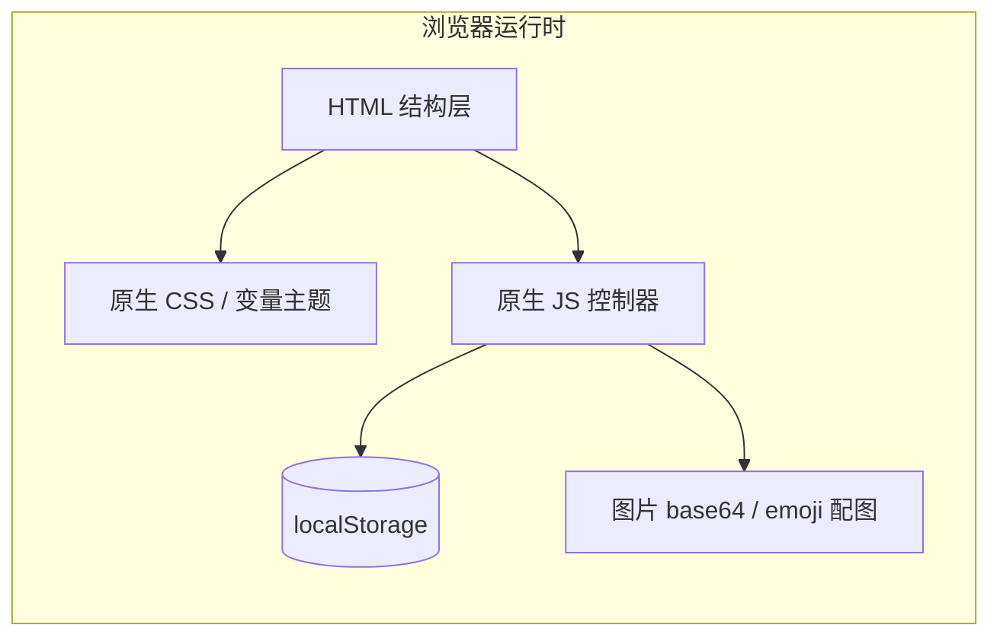

# 懒人手账 - 技术架构文档

## 1. 架构设计

根据用户明确要求"单个 HTML 文件、双击即用、不引入 Vue/React"，采用纯前端单文件架构：



## 2. 技术描述

- **前端**：HTML5 + 原生 CSS3（CSS 变量驱动主题切换） + 原生 JavaScript（ES2020）
- **外部依赖**：仅通过 CDN 引入 Font Awesome 6（图标）
- **存储方案**：localStorage 持久化
- **构建工具**：无（单文件）
- **运行方式**：双击 `index.html` 即可在任意现代浏览器运行

> 备注：用户已明确指定"不引入 Vue/React，轻量化演示"、"CSS 推荐 Tailwind、亦可原生"，本项目最终选用**原生 CSS（CSS 变量主题）**，原因：
> 1. 主题切换（4 套色卡）用 CSS 变量最轻量
> 2. 单文件零依赖更易"双击即用"
> 3. 满足"轻量化演示"目标

## 3. 文件结构

```
lazy-handbook/
├── index.html              # 单文件原型入口（HTML + CSS + JS 全部内联）
├── README.md               # 使用说明（可选）
└── .trae/documents/        # PRD & 技术架构
    ├── PRD.md
    └── Technical-Architecture.md
```

## 4. 页面与路由（单页伪路由）

由于是单文件，所有"页面"通过 JS 控制 `display` 切换，模拟小程序路由栈：

| 视图 ID | 名称 | Tab 归属 | 入口 |
|---------|------|----------|------|
| `view-home` | 首页 | Tab1 | 启动默认 / 底部 Tab1 |
| `view-memories` | 我的记忆 | Tab2 | 底部 Tab2 |
| `view-calendar` | 手账日历 | Tab3 | 底部 Tab3 |
| `view-mine` | 我的 | Tab4 | 底部 Tab4 |
| `view-edit` | 手账录入页 | 二级 | 首页大图/双入口/底部+号 |
| `view-detail` | 手账详情 | 弹层/二级 | 卡片点击 |
| `view-tags` | 标签云 | 弹层 | Tab2 右上角 |
| `view-growth` | 我的成长 | 二级 | 首页搜索+号 / Tab4 我的成长 |
| `view-profile-edit` | 个人资料编辑 | 二级 | Tab4 个人资料 |
| `view-settings` | 设置 | 二级 | Tab4 设置 |
| `view-login` | 登录授权 | 弹层 | 未登录拦截/手动登录 |

## 5. 核心模块拆分

### 5.1 状态管理（State）
通过单一 `AppState` 对象 + `setState()` 触发 `render()`：
```js
const AppState = {
  user: null,             // 登录用户
  handbooks: [],          // 手账列表
  activeTab: 'home',      // 当前 Tab
  activeView: 'home',     // 当前主视图
  searchKeyword: '',
  activeMood: '😊',       // 悬浮表情
  selectedDate: null,     // 录入页日期
  filterTag: null,        // 标签筛选
  theme: 'default'        // 主题
};
```

### 5.2 存储层（Storage）
封装 `Storage` 模块：
- `get(key, fallback)`
- `set(key, value)`
- `remove(key)`
- `clearAll()`（重置按钮）
- 统一 key 前缀 `lh_`

### 5.3 视图层（View）
- `renderTabBar()` 底部导航
- `renderHome()` 首页
- `renderMemories()` 我的记忆
- `renderCalendar()` 手账日历
- `renderMine()` 我的
- `renderEdit(id?)` 手账录入
- `renderDetail(id)` 手账详情
- `renderTags()` 标签云弹层
- `renderGrowth()` 成长
- `renderProfileEdit()` 资料编辑
- `renderSettings()` 设置
- `renderLogin()` 登录弹窗

### 5.4 数据层（Data）
- `initSeedData()` 注入 10 条内置手账（无图片则用 emoji 占位缩略图）
- `getHandbookById(id)`
- `saveHandbook(record)`
- `deleteHandbook(id)`
- `getHandbooksByTag(tag)`
- `getHandbooksByDate(date)`
- `getAllTags()`

### 5.5 工具层（Utils）
- 日期处理（公历/农历/格式化）
- ID 生成（`crypto.randomUUID`）
- 简易 toast/confirm 弹窗
- 图片上传（FileReader → base64 → localStorage）
- 模拟 AI 识别（基于上传时间随机生成标题/正文/标签）

## 6. 数据模型

### 6.1 用户 (User)
| 字段 | 类型 | 说明 |
|------|------|------|
| id | string | UUID |
| avatar | string | 头像 base64 / emoji |
| nickname | string | 昵称 |
| phone | string | 手机号 |
| growth | number | 成长值 |
| role | string | 角色（宝妈/上班族/学生/其他） |
| style | string | 风格偏好（治愈/文艺/简洁/赛博） |
| isLoggedIn | boolean | 登录态 |

### 6.2 手账 (Handbook)
| 字段 | 类型 | 说明 |
|------|------|------|
| id | string | UUID |
| date | string | YYYY-MM-DD |
| title | string | 标题（AI 生成可编辑） |
| content | string | 正文 |
| images | string[] | 图片 base64 数组 |
| tags | string[] | 标签 |
| mood | string | emoji 表情 |
| pinned | boolean | 是否置顶 |
| createdAt | number | 时间戳 |

### 6.3 设置 (Settings)
| 字段 | 类型 | 说明 |
|------|------|------|
| theme | 'default'\|'cute'\|'warm'\|'cyber' | 主题 |
| activeMood | string | 首页悬浮表情 |

## 7. 主题切换实现

通过 `<html data-theme="default|cute|warm|cyber">` 切换 CSS 变量，4 套色卡由 PRD 4.2 节定义。所有 4 套色卡同步以 CSS 变量组形式写入 HTML 内联样式中。

```css
:root,
[data-theme="default"] {
  --color-primary: #FF9A8B;
  --color-primary-dark: #E07A6B;
  --color-secondary: #F6D6AD;
  --color-accent: #B7E4C7;
  --color-text: #3A2E2A;
  --color-text-sub: #8C7A75;
  --color-bg: #FFF8F3;
  --color-card: #FFFFFF;
  --color-disabled: #D9C9C2;
  --color-shadow: rgba(255,154,139,0.18);
}
[data-theme="cute"]  { --color-primary:#FF7AB6; --color-bg:#FFF5FA; ... }
[data-theme="warm"]  { --color-primary:#F2A65A; --color-bg:#FFFBF2; ... }
[data-theme="cyber"] { --color-primary:#7B2CBF; --color-bg:#0F0A1F; --color-text:#F2E9FF; ... }
```

## 8. 初始数据（种子）
- 10 条手账，覆盖近 10 天不同日期
- 图片：使用 CSS 渐变 + emoji 模拟占位（避免依赖网络）
- 标签：生活/家庭/工作/美食/旅行/心情 等

## 9. 关键交互
- Tab 切换：高亮 + 视图切换 + 滚动复位
- 搜索：仅作用于 Tab2 时间线，实时过滤
- 悬浮表情：循环切换 5 种表情，记忆选择
- 手账录入：图片上传 → 模拟 AI 排版 → 文本可编辑 → 保存
- 日历：月视图，点击日期 → 切到 Tab2 并过滤
- 主题切换：实时切换 CSS 变量，无需刷新
- 登录拦截：未登录用户点击写手账/日历 → 弹窗
- 清空数据：二次确认 → 恢复默认

## 10. 兼容性
- iOS Safari 14+ / Chrome 90+ / Edge 90+
- 桌面浏览器可缩放，390px 居中
- 触摸目标 ≥ 44px
